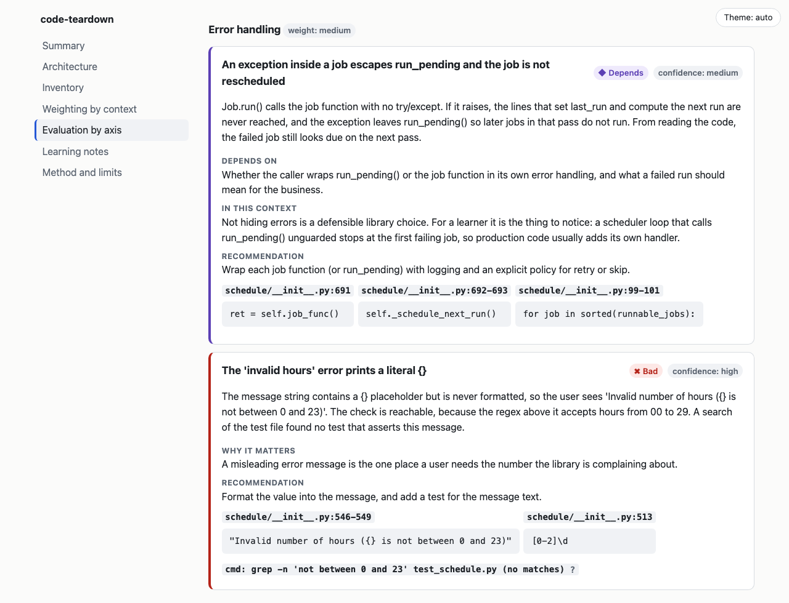
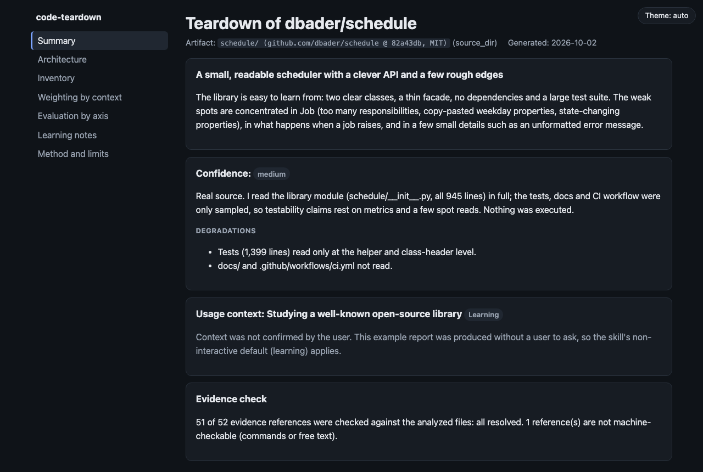

# code-teardown

**Point it at a repo, a `.pyc` or a Docker image and get a critical teardown: what is good, what is bad, and what depends on how you will use it, every claim backed by cited evidence, in one self-contained HTML report.**

A skill for [Claude Code](https://code.claude.com) (and any agent that supports the [Agent Skills](https://agentskills.io) format) for developers who want to *learn* from other people's code.


<details>
<summary>More screenshots</summary>

A finding with its verdict, confidence, "depends on" analysis and verifiable evidence:



Dark theme (follows your system, with a manual toggle):



</details>

## Why this exists

Reverse-engineering skills tend to aim at malware and disassemblers. "Explain this codebase" skills tend to aim at non-technical readers. The gap is a **verdict**: an honest, context-weighted judgment of how a *normal* artifact (a repo, a `.pyc`, a Docker image) is built, for developers who want to get better.

- **Verdicts, not summaries.** Each finding is `good`, `improvable`, `bad` or `depends`, with a confidence level.
- **Weighted by your context.** A global config object is fine in a script, a hazard in a library. The skill asks how the thing will be used and weighs six axes accordingly.
- **Evidence or silence.** Every claim cites `file:line`, a layer, a history entry or a config field. A validator rejects uncited claims and checks citations against the real files.
- **Honest about what it can't know.** Decompiled code loses names and intent; obfuscated code and native binaries limit the analysis. The report says so and caps its own confidence.

## What it analyzes (v0)

| Artifact | How |
| --- | --- |
| Source directory or repo | Inventory, import graph, per-function metrics, risk signals |
| `.pyc` files, `__pycache__`, wheels, zipapps, eggs, sdists | Disassembly with the standard library (same Python version), optional external decompiler, header and strings as a fallback |
| Docker images (`docker save` tar, extracted dir, or an image name) | Config, layers, reconstructed Dockerfile instructions, merged filesystem, deleted-but-recoverable files |

JAR, APK, .NET and native binaries are recognized and declined (see the [roadmap](#roadmap)).

## Install

Requirements: Python 3.11+. Optional: [`pycdc`](https://github.com/zrax/pycdc) or `decompyle3` for better `.pyc` output; the Docker CLI only if you analyze an image by name.

**As a plugin** (updates with the marketplace):

```bash
claude plugin marketplace add Hermida95/code-teardown
claude plugin install code-teardown@code-teardown
```

**As a plain skill** (copy it into your skills folder):

```bash
git clone https://github.com/Hermida95/code-teardown ~/.claude/skills/code-teardown
```

To try it from a checkout without installing: `claude --plugin-dir ./code-teardown`.

## Use

Just ask. The skill triggers on requests like:

- "Tear down `~/src/httpx`: which patterns should I copy and which are anti-patterns?"
- "Here is a `docker save` tar of our staging image. What is good, what is sloppy, does anything leak?"
- "I found these `.pyc` files and don't have the source. How was it built and is it any good?"

It will ask how the artifact will be used (production service, automation script, library, learning), then write `code-teardown-<name>.html` and give a ten-line summary in chat.

An [example report](examples/schedule/report.html) on [`dbader/schedule`](https://github.com/dbader/schedule) (MIT) is included, with its [`findings.json`](examples/schedule/findings.json). To re-verify its 52 citations yourself:

```bash
git clone https://github.com/dbader/schedule && git -C schedule checkout 82a43db
python3 scripts/render_report.py examples/schedule/findings.json --out /tmp/report.html --root schedule
```

## How it works

Eight steps. Scripts do what is deterministic; the model does what needs judgment.

| Step | Who | What |
| --- | --- | --- |
| 1 Identify | `identify_artifact.py` | Artifact type from magic bytes and layout |
| 2 Extract | `extract_pyc.py`, `inspect_docker_image.py` | Work directory, with declared degradation when a tool is missing |
| 3 Inventory | `inventory.py` | Languages, dependencies, entry points, import graph, metrics, signals |
| 4 Architecture | model | System → components → modules → key functions |
| 5 Context | model, asks you | Production service, script, library or learning; sets the weights |
| 6 Assess | model | Separation of concerns, error handling, security, testability, coupling, performance |
| 7 Learn | model | Patterns to copy, anti-patterns to avoid, and why |
| 8 Report | `render_report.py` | Validates evidence and renders the HTML |

The judgment lives in [`SKILL.md`](SKILL.md) and [`references/`](references/): criteria per axis, the context weighting matrix, a confidence guide and the `findings.json` schema.

## Safety model

This is a **static** analyzer for learning, not a security tool.

- It never runs, imports, installs or tests the artifact or decompiled code. `marshal` runs in an isolated child process with a timeout. Images are read with `docker save` only; nothing is started.
- Everything inside the artifact is treated as **data**: README text, comments and strings that address an AI are ignored and reported as a finding (the test fixtures include a repo that tries exactly this).
- Archives are extracted with traversal and size guards; only regular files are written.
- Secret values are never echoed: findings cite the name and location, and the report refuses text that looks like a token or key.
- The HTML loads no external resources, escapes all content and ships a hash-based Content-Security-Policy.

## Limitations

- A `.pyc` from a different Python than the one running the scripts can only be read for its header and strings unless a decompiler is installed. Decompiler integration is exercised with stand-in tools in tests, not yet with real `pycdc` or `decompyle3` builds.
- Import graph and function metrics are Python-only. Other languages get size, manifests and entry points, and the model reads the code directly with lower confidence.
- Docker support is tested against synthetic archives in the classic and OCI layouts. An opt-in integration test (`pytest -m docker`) uses a real daemon.
- Findings are only as good as the model's reading. The validator proves a citation exists and says what it says, not that the conclusion is right. Treat the report as a well-sourced second opinion.

## Roadmap

- **v1:** JAR/class files, Android APKs and .NET assemblies (the skill declines them today).
- Function metrics and import graphs for JavaScript/TypeScript and Go.
- Validation against real `pycdc` and `decompyle3` output, and more decompiler back ends.
- Multi-platform image selection and per-layer file diffs.
- More report languages (the UI is English and Spanish today).

## Development

```bash
python3 -m venv .venv && .venv/bin/pip install pytest
.venv/bin/pytest            # everything; the Docker integration test is skipped if no daemon is running
.venv/bin/pytest -m docker  # only the Docker integration test (needs a running daemon)
```

Scripts use only the standard library. See [`evals/`](evals/README.md) for the with-and-without-skill comparison harness.

## Licence and responsible use

MIT, see [LICENSE](LICENSE). Use this for learning from your own software, open-source projects, or code you have the owner's permission to study. It is not meant to circumvent licences, protections or EULAs, and it declines requests that are.
