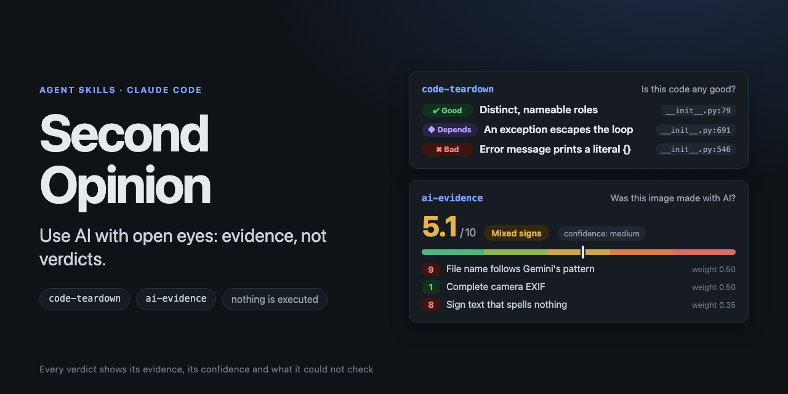

# Second Opinion

**Agent Skills for using AI with open eyes.**

AI now writes code and makes images that look finished. Before you adopt, ship or share them, you want a second opinion that shows its work. These skills give you one: every verdict comes with evidence, a confidence level, and a list of what could *not* be checked. No black-box "92% fake", no vague "looks fine".

Built for [Claude Code](https://claude.com/claude-code) and any client that supports Agent Skills. Standard-library Python, nothing is ever executed or uploaded, and each run ends in one self-contained HTML report you can read or share.

## The skills

| | Skill | The question it answers |
| --- | --- | --- |
| 🔍 | [**code-teardown**](skills/code-teardown) | *"Is this code any good, and should I build on it?"* A critical teardown of a repo, a `.pyc` file or a Docker image: what is well built, what is not, and what depends on how you will use it. Every claim cites `file:line` and is checked against the real files. |
| 🧾 | [**ai-evidence**](skills/ai-evidence) | *"Was this made or edited with AI?"* Every signal in an image (generator records, Content Credentials, EXIF, dimensions, what the model sees) gets a **0-10 score** and a **trust weight**; they are combined into two scored answers, *generated* and *edited with AI*, with a confidence level. |

### What a result looks like

`ai-evidence` does not say "this is AI". An example of what it reports for an image whose file name says Gemini but whose EXIF looks like a camera:

> **Generated by AI?** 5.1 / 10 · *mixed signs* · confidence medium
> `9` File name follows Gemini's download pattern · weight 0.50
> `1` Complete camera EXIF · weight 0.50 · *can be copied or forged*
> `8` Shop sign with letter-like shapes that spell nothing · weight 0.35 · *visual, capped*
> *Not checked: pixel forensics, invisible watermarks, C2PA signature validity*

When one item is conclusive (say, Stable Diffusion's own parameter block), it decides the score; when two conclusive items disagree, the result is "conflicting evidence" instead of an average.

`code-teardown` does the same for software: findings marked good, improvable, bad or *depends*, each with its evidence and its confidence.

## Why these two together

Both answer the same uncomfortable question: *how much should I trust something I did not make myself?* Both follow the same rules.

- **Evidence or silence.** If a claim cannot point at something checkable, it is not made.
- **Honest about limits.** "Not enough evidence" and "conflicting evidence" are valid results, and each report lists what it could not verify.
- **Static and private.** Analyzed content is read, never run, and never sent anywhere.
- **Content is data.** A README, a comment or text hidden in an image cannot give the skill instructions.
- **Plain Python.** Standard library only, so there is nothing to install and little to audit.

## Install

As plugins (one marketplace, two plugins):

```bash
claude plugin marketplace add Hermida95/second-opinion-skills
claude plugin install code-teardown@second-opinion
claude plugin install ai-evidence@second-opinion
```

Or copy a single skill into your skills folder (keep the folder name; it must match the skill's name):

```bash
git clone https://github.com/Hermida95/second-opinion-skills
cp -R second-opinion-skills/skills/ai-evidence ~/.claude/skills/ai-evidence
```

To try one from a checkout without installing: `claude --plugin-dir ./skills/ai-evidence`.

Then just ask: *"tear down ~/src/httpx"*, *"is this image AI-generated?"*, *"¿esta imagen está hecha con IA?"*. Naming the skill is the most reliable trigger.

### Upgrading from the old `code-teardown` repository

This repository used to hold only `code-teardown`, under that name. If you installed it before 2026-10-08, your marketplace entry still points at the old name. Remove it and add the new one:

```bash
claude plugin marketplace remove code-teardown
claude plugin marketplace add Hermida95/second-opinion-skills
claude plugin install code-teardown@second-opinion
```

Links to the old repository URL redirect here.

## Roadmap

- **ai-evidence:** optional pixel forensics, then text and code (stylometric and provenance signals, with low weights and clear false-positive warnings), and a labelled test set to calibrate the weights.
- **code-teardown:** JAR, APK and .NET artifacts, more languages in the metrics.
- More skills in the same spirit: practical checks for people who use AI at work.

Ideas and issues are welcome.

## Repository layout

```
skills/
  code-teardown/   SKILL.md, scripts/, references/, evals/, tests/, README.md ...
  ai-evidence/     SKILL.md, scripts/, references/, tests/, README.md ...
```

Each skill folder is self-contained, with its own README, tests, changelog and licence, so it can be installed or tested alone:

```bash
python3 -m venv .venv && .venv/bin/pip install pytest
cd skills/code-teardown && ../../.venv/bin/pytest
cd ../ai-evidence && ../../.venv/bin/pytest
```

Run the two suites separately: they use the same names for their helper modules.

## Contributing

See each skill's `CONTRIBUTING.md`. The shared rules: evidence or silence, no execution of analyzed content, standard library only in `scripts/`, and a test that fails without every fix.

## Licence

MIT, © Miguel Garcia Hermida.
