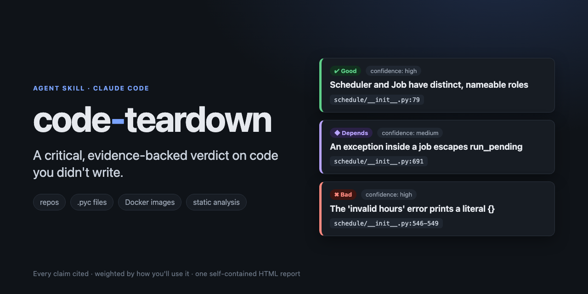
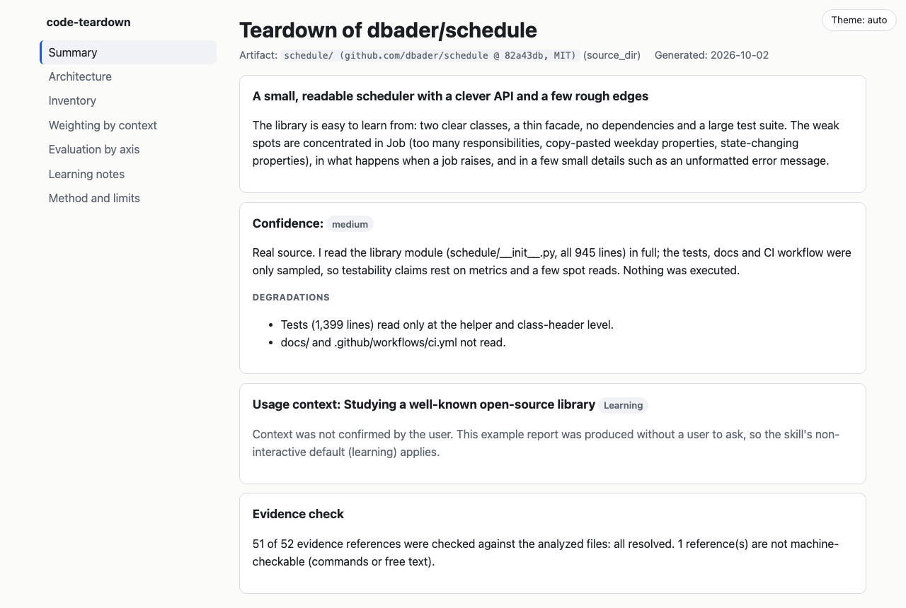

<div align="center">



# code-teardown

**A critical, evidence-backed verdict on code you didn't write.**

Point it at a repo, a `.pyc` or a Docker image. Get what is good, what is bad and what *depends on how you will use it*, as one self-contained HTML report.

[](https://github.com/Hermida95/second-opinion-skills/actions/workflows/tests.yml)
[](LICENSE)
[](#install)
[](#development)
[](https://agentskills.io)

[Install](#install) · [See it in action](#see-it-in-action) · [How it works](#how-it-works) · [Safety](#safety-model) · [Does it help?](#does-it-actually-help) · [Roadmap](#roadmap)

</div>

---

A skill for [Claude Code](https://code.claude.com) (and any agent that supports the [Agent Skills](https://agentskills.io) format) for developers who want to **learn** from other people's code.

- **A verdict, not a summary.** Every finding is `good`, `improvable`, `bad` or `depends`, with a confidence level.
- **Weighted by your context.** A global config object is fine in a script and a hazard in a library. It asks how the thing will be used and weighs six axes accordingly.
- **Evidence or silence.** Every claim cites `file:line`, a layer, a history entry or a config field. A validator rejects uncited claims and checks each citation against the real files.
- **Honest about its limits.** Decompiled code loses names and intent; obfuscated code and native binaries limit the analysis. The report says so and caps its own confidence.
- **Static and safe.** It never runs what it analyzes, treats the artifact's text as data (prompt injection included) and never echoes secrets.

## See it in action

You say:

> Take apart `~/src/schedule` and tell me which patterns I should copy and which are anti-patterns.

It answers in chat with a short summary like this one (written from the [example report](examples/schedule/report.html) that comes with the repo):

> **dbader/schedule**: an in-process job scheduler in one 945-line module, no runtime dependencies.
> **Confidence: medium.** I read the whole library module; tests and docs only sampled. Context assumed: *learning*.
>
> **Done best:** a clear `Scheduler`/`Job` split behind a thin module facade; an exception hierarchy with early, instructive errors; zero hard dependencies, 81 tests, mypy and black in tox.
>
> **Matters most here:** the "invalid hours" error prints a literal `{}` (`schedule/__init__.py:546-549`); an exception inside a job escapes `run_pending` and the job is not rescheduled (*depends* on whether you wrap it); `Job` mixes DSL, time parsing and timezone maths, and seven weekday properties are copy-pasted.
>
> Report written; 51 of 52 citations machine-verified. Static analysis only.

…and writes a navigable HTML report (light and dark, works offline):



<details>
<summary>A finding, with its verdict, confidence and verifiable evidence</summary>


</details>

<details>
<summary>Dark theme</summary>


</details>

## What it analyzes (v0)

| Artifact | How |
| --- | --- |
| Source directory or repo | Inventory, import graph, per-function metrics, risk signals |
| `.pyc` files, `__pycache__`, wheels, zipapps, eggs, sdists | Disassembly with the standard library (same Python version), optional external decompiler, header and strings as a fallback |
| Docker images (`docker save` tar, extracted dir, or an image name) | Config, layers, reconstructed Dockerfile instructions, merged filesystem, deleted-but-recoverable files |

JAR, APK, .NET and native binaries are recognized and declined (see the [roadmap](#roadmap)).

## Install

Requirements: Python 3.11+. Optional: [`pycdc`](https://github.com/zrax/pycdc) or `decompyle3` for better `.pyc` output; the Docker CLI only if you analyze an image by name.

**As a plugin** (updates with the marketplace):

```bash
claude plugin marketplace add Hermida95/second-opinion-skills
claude plugin install code-teardown@second-opinion
```

**As a plain skill** (copy it into your skills folder):

```bash
git clone https://github.com/Hermida95/second-opinion-skills
cp -R second-opinion-skills/skills/code-teardown ~/.claude/skills/code-teardown
```

Keep the folder name `code-teardown`: the Agent Skills format expects it to match the skill's name.

To try it from a checkout without installing: `claude --plugin-dir ./skills/code-teardown`.

## Use

Just ask. The skill triggers on requests like:

- "Tear down `~/src/httpx`: which patterns should I copy and which are anti-patterns?"
- "Here is a `docker save` tar of our staging image. What is good, what is sloppy, does anything leak?"
- "I found these `.pyc` files and don't have the source. How was it built and is it any good?"

If Claude does not pick the skill up on its own, name it ("use code-teardown on ~/src/project") or type `/code-teardown` and let autocomplete find it (plugin installs may show it as `/code-teardown:code-teardown`).

It will ask how the artifact will be used (production service, automation script, library, learning), then write `code-teardown-<name>.html` and give a ten-line summary in chat.

To re-verify the example's 52 citations yourself:

```bash
git clone https://github.com/dbader/schedule && git -C schedule checkout 82a43db
python3 scripts/render_report.py examples/schedule/findings.json --out /tmp/report.html --root schedule
```

## How it works

Eight steps. Scripts do what is deterministic; the model does what needs judgment.

| Step | Who | What |
| --- | --- | --- |
| 1 Identify | `identify_artifact.py` | Artifact type from magic bytes and layout |
| 2 Extract | `extract_pyc.py`, `inspect_docker_image.py` | Work directory, with declared degradation when a tool is missing |
| 3 Inventory | `inventory.py` | Languages, dependencies, entry points, import graph, metrics, signals |
| 4 Architecture | model | System → components → modules → key functions |
| 5 Context | model, asks you | Production service, script, library or learning; sets the weights |
| 6 Assess | model | Separation of concerns, error handling, security, testability, coupling, performance |
| 7 Learn | model | Patterns to copy, anti-patterns to avoid, and why |
| 8 Report | `render_report.py` | Validates evidence and renders the HTML |

The judgment lives in [`SKILL.md`](SKILL.md) and [`references/`](references/): criteria per axis, the context weighting matrix, a confidence guide and the `findings.json` schema.

## Does it actually help?

Compared with the same model **without** the skill on four tasks with known answers (a repo, a `.pyc`, a Docker image, and a repo that tries to prompt-inject its reviewer), graded by objective checks ([`evals/`](evals/README.md)):

| Task | With skill | Without |
| --- | --- | --- |
| Repo | 15/15 | 15/15 |
| `.pyc` | 11/11 | 9/11 |
| Docker image | 13/13 | 11/13 |
| Prompt-injection repo | 11/11 | 10/11 |

Both found the same substantive defects, and both resisted the injection. The difference is **discipline and verifiability**: without the skill, reports printed secret values, left out confidence levels, cited nothing for one task, and in two of four runs the agent **executed code from the artifact** it was analyzing. With the skill, none did, and every citation is machine-checked.

One run per cell is a signal, not a statistic, and the skill costs about 15% more tokens. The harness is in the repo so you can rerun it.

## Safety model

This is a **static** analyzer for learning, not a security tool. See [SECURITY.md](SECURITY.md).

- It never runs, imports, installs or tests the artifact or decompiled code. `marshal` runs in an isolated child process with a CPU limit and a timeout. Images are read with `docker save` only; nothing is started.
- Everything inside the artifact is treated as **data**: README text, comments and strings that address an AI are ignored and reported as a finding (the test fixtures include a repo that tries exactly this).
- Archives are extracted with traversal and size guards; only regular files are written.
- Secret values are never echoed: findings cite the name and location, and the report refuses text that looks like a token or key.
- The HTML loads no external resources, escapes all content and ships a hash-based Content-Security-Policy.
- The skill does **not** pre-approve its scripts, so your permission settings decide what runs unprompted. The scripts write only a new or empty work directory, one `.json` and one `.html`, and refuse to overwrite an existing file without `--force`.
- Hostile inputs are bounded: regexes that read artifact text have bounded input and no catastrophic patterns, deep nesting is contained per file, archives have size and entry budgets, and image references are validated before `docker save`.
- The test fixtures under `evals/` are **intentionally vulnerable** (a prompt-injection repo, planted secrets and SQL injection). They are inert data and are never executed.

## Limitations

- Activation depends on what else you have installed, and on how it is measured. With the skill registered in a project next to about 100 other skills, Claude's first action was this skill for 16 of 16 requests that should trigger it (eight phrasings that never name it, two runs each) and for 0 of 24 near-misses (PR review, security review, running tests, refactoring, malware analysis...); where a more specific skill exists it picks that one. That is a small sample on one machine ([how it was measured](evals/README.md)); if it ever misses, name the skill.
- Requires Python 3.11+. Older interpreters get a clear message instead of a traceback.
- A `.pyc` from a different Python than the one running the scripts can only be read for its header and strings unless a decompiler is installed. Decompiler integration is exercised with stand-in tools in tests, not yet with real `pycdc` or `decompyle3` builds.
- Import graph and function metrics are Python-only. Other languages get size, manifests and entry points, and the model reads the code directly with lower confidence.
- Docker support is verified against real `docker save` output from Docker 29.8 (including a real multi-layer build) and against synthetic archives for the OCI-index-only layout. Run `pytest -m docker` to repeat the real-daemon checks.
- Findings are only as good as the model's reading. The validator proves a citation exists and says what it says, not that the conclusion is right. Treat the report as a well-sourced second opinion.

## Roadmap

- **v1:** JAR/class files, Android APKs and .NET assemblies (the skill declines them today).
- Function metrics and import graphs for JavaScript/TypeScript and Go.
- Validation against real `pycdc` and `decompyle3` output, and more decompiler back ends.
- Multi-platform image selection and per-layer file diffs.
- More report languages (the UI is English and Spanish today).

## Development

```bash
python3 -m venv .venv && .venv/bin/pip install pytest
.venv/bin/pytest            # everything; Docker tests are skipped if no daemon is running
.venv/bin/pytest -m docker  # only the Docker tests (need a running daemon)
```

Scripts use only the standard library. CI runs the suite on Python 3.11 to 3.14. See [CONTRIBUTING.md](CONTRIBUTING.md) and the [changelog](CHANGELOG.md).

## Licence and responsible use

MIT, see [LICENSE](LICENSE). Use this for learning from your own software, open-source projects, or code you have the owner's permission to study. It is not meant to circumvent licences, protections or EULAs, and it declines requests that are.
